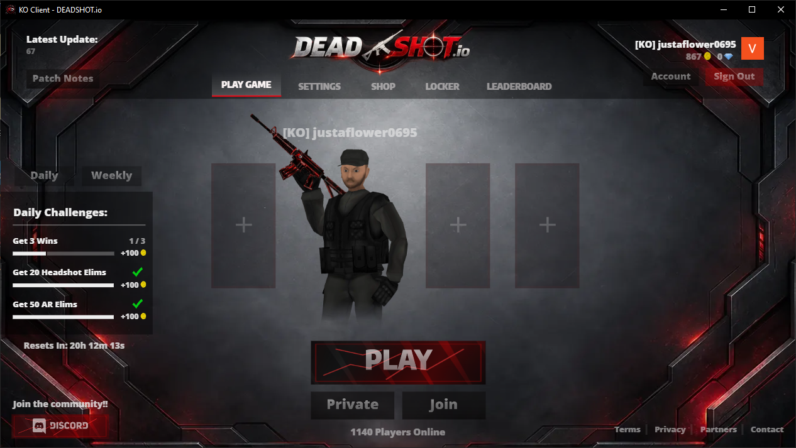
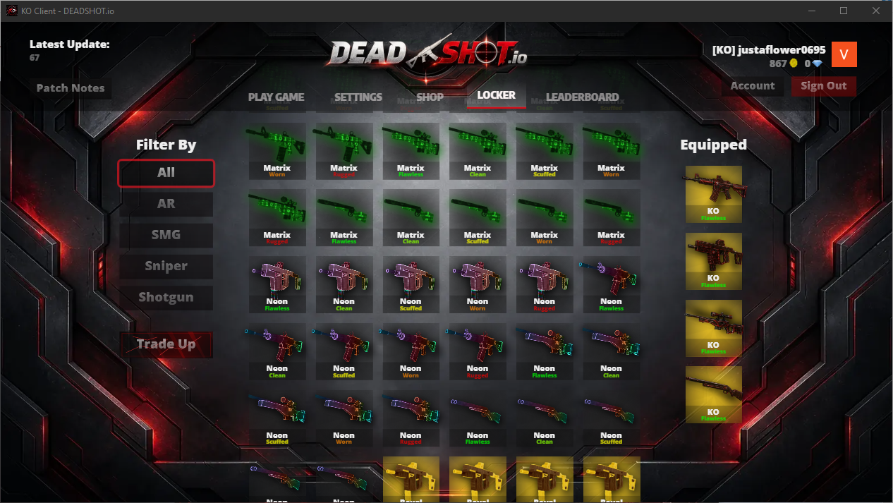
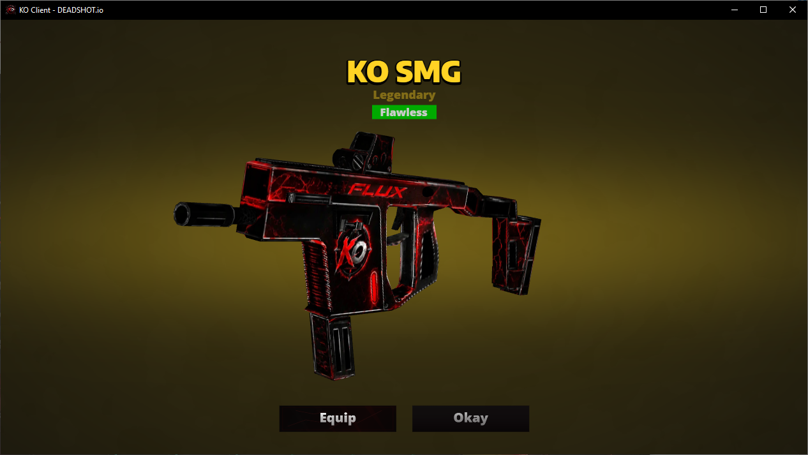

# KO Client - DEADSHOT.io

**lightweight, low RAM usage, exclusive KO skins, UI mods, ads/tracker blocking.**

 

<table>
  <tr>
    <td align="center"><strong>Main Screen</strong></td>
  </tr>
  <tr>
    <td align="center"></td>
  </tr>
</table>

<table>
  <tr>
    <td align="center"><strong>Skin Unlock</strong></td>
    <td align="center"><strong>KO Skin Preview</strong></td>
  </tr>
  <tr>
    <td align="center"></td>
    <td align="center"></td>
  </tr>
</table>

---

## What's Good?

- lightweight, fps stable, low CPU, low RAM usage.
- 60x lighter than Omniverse: Omniverse Client ~150 MiB vs KO Client ~2.5 MiB.
- blocks ads, trackers, and junk analytics.
- exclusive KO Clan skins.
- all skin unlock mod.
- cleaner and tighter UI mod.
- auto update included.

## License

Proprietary. All rights reserved. See [`LICENSE`](../LICENSE).
