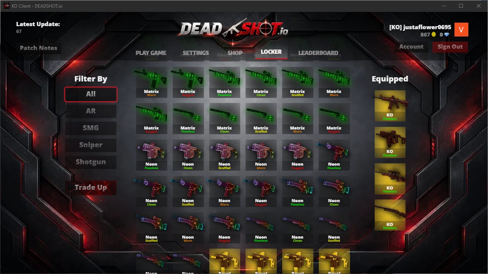
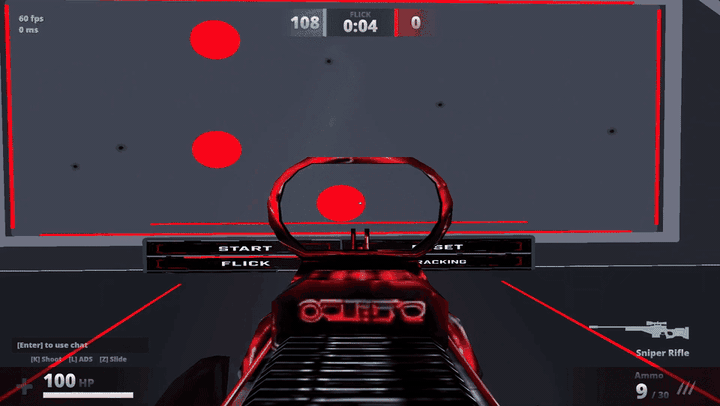
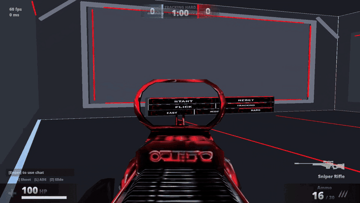
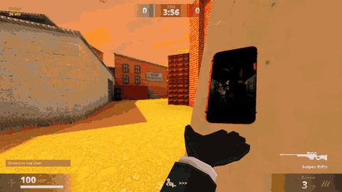

# ko client for deadshot.io

**tiny client. full skins. no electron tax. no ads babysitting your match.**

<code>FluxMeansFlex.KOClient-win-Setup.exe</code> · 7.21 MiB · SHA-256 <code>fca0860ee98a9fb3d7af8d00c7ee6087addaf31624f5dc7fa4a6f0d72eb5f8e5</code>

 

<table>
  <tr>
    <td align="center" width="50%">
      <strong>full skin unlock</strong> 
      
    </td>
    <td align="center" width="50%">
      <strong>training flick</strong> 
      
    </td>
  </tr>
  <tr>
    <td align="center" width="50%">
      <strong>training bots</strong> 
      
    </td>
    <td align="center" width="50%">
      <strong>melee</strong> 
      
    </td>
  </tr>
</table>

---

## why bother

- **lightweight, fps stable, low cpu, low ram usage**
- **custom crosshair for shotgun, ar, and smg**
- **full skin unlock**
- **20x lighter than omniverse** — ko client is ~7.21 mib, omniverse ~146 mib. do the math.
- **blocks ads, trackers, and junk analytics** — advertising code deleted from the native layer. your match does not need a telemetry parade.
- **training that actually trains** — grid shot, tracking, bots, hud, session tracking, results. aim lab energy without the subscription.
- **visual control freak mode** — 4:3 stretched, plus brightness / contrast / vibrance tuning in that nvidia/valorant flavor.
- **potato mode** — less fluff, more frames, fps booster.
- **melee support** — swap to the ko phone melee and watch tiktok mid-round.

---

## license

proprietary. all rights reserved. see [`LICENSE`](../LICENSE).

